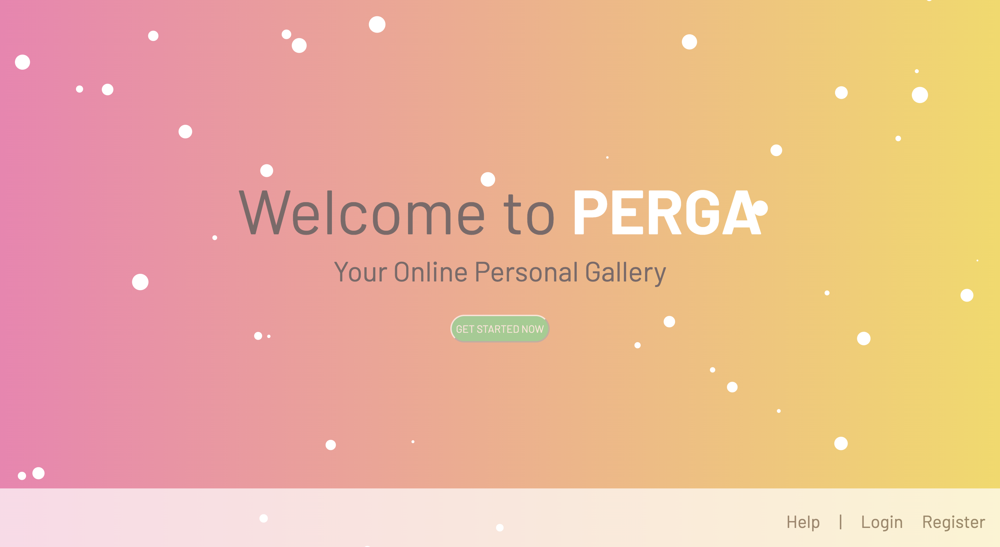
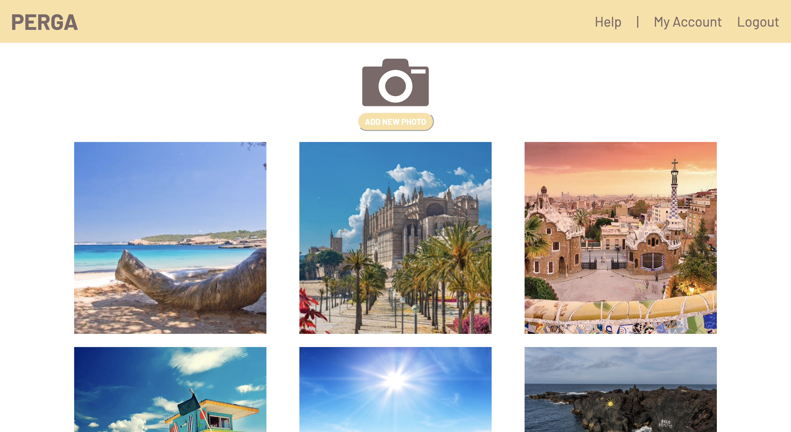

# Personal Gallery Web App (PERGA)

Web application that connects to [this](https://github.com/soraiavmv/simple-rest-api) Rest API and let's you upload pictures to an S3 compatible bucket. The previously uploaded pictures are shown

## Tech Stack
**Webapp**: NextJS, TypeScript, Emotion
**API**: NodeJS + Express, TypeScript, MinIo Client
**Object Storage**: MinIo
**Containerization**: Docker compose

## Screen examples
### Welcome Screen


### Gallery Screen


### Gallery Screen With Picture Popup


## Installation

Use [docker compose](https://docs.docker.com/compose/) to install and run the app.

```bash
docker-compose build
```
## Run

```bash
docker-compose up 
```
**NOTE**: App will be accessible on _localhost:3000_

## Contributing
Pull requests are welcome. For major changes, please open an issue first to discuss what you would like to change.

## License
[MIT](https://choosealicense.com/licenses/mit/)